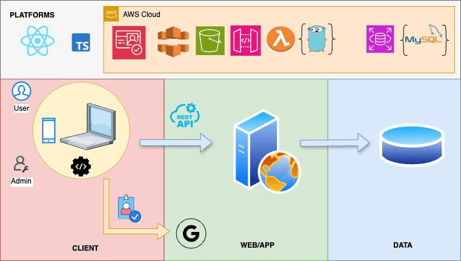

# Web Forum Powered by AWS: Overview

This repository provides an overview of the Web Forum project, including its architecture, design, and links to the individual repositories for the frontend, backend, and database.

## Project Repositories
- [Backend Repository](https://github.com/arnavbajpai/Web-Forum-powered-by-AWS-Backend-REST-API): Developed using GoLang and deployed on AWS Lambda and API Gateway.
- [Frontend Repository](https://github.com/arnavbajpai/Web-Forum-powered-by-AWS-Frontend): Built with React.js and hosted on AWS S3.
- [Database Repository](https://github.com/arnavbajpai/Web-Forum-powered-by-AWS-Backend-REST-API): Built on MySQL, hosted on AWS RDS.

## Project Architecture
The Web Forum application is designed as a scalable and modular system, leveraging modern cloud technologies.

## Features
- **Backend**: RESTful API implementation using GoLang.
- **Frontend**: A responsive user interface developed with React.js.
- **Database**: Structured storage in MySQL for users, threads, and posts.
- **Authentication**: Secure Google-based login powered by AWS Cognito.
- **Cloud Deployment**:
  - AWS S3 and CloudFront for frontend hosting.
  - AWS Lambda and API Gateway for the backend.
  - AWS RDS for the database.

## Getting Started
For detailed setup and usage instructions, refer to the README files in each repository.

## Contact
If you have questions or suggestions, feel free to reach out at [arnavbcool@gmail.com](mailto:arnavbcool@gmail.com).

